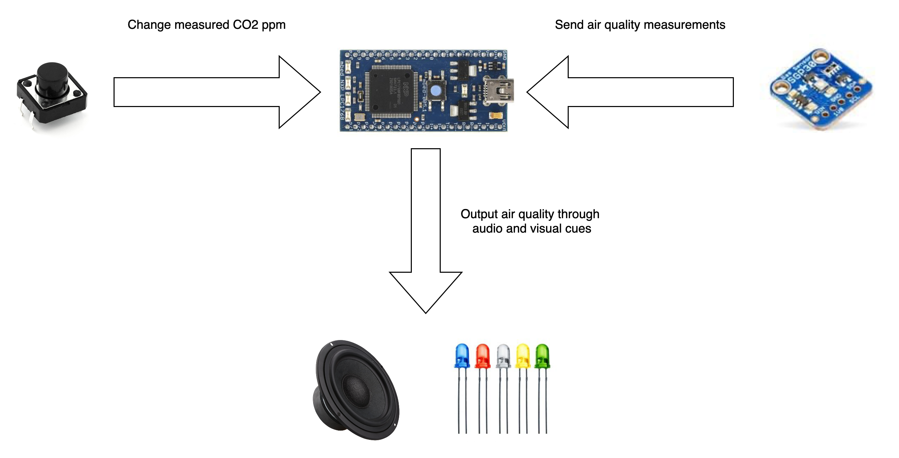

# SmartSmoke: Air Quality Regulator

SmartSmoke measures air quality and alerts users when hazerdous conditions arise. SmartSmoke measures total volatile organic compound (TVOC) concentration in the air and converts measurements to equivalent carbon-dioxide (eCO2) concentration.

Using known levels of CO2 concentration from the Occupational Health and Safety Administration, SmartSmoke is able to determine if observed level of eCO2 concentration is dangerous and alerts users with sounds and seirens.

The level of threshold levels defined by the Occupational Health and Safety Administration are listed in the table below:

| CO2 Concentration (ppm) | Description                                                                                                                                                                                                     |
|-------------------------|-----------------------------------------------------------------------------------------------------------------------------------------------------------------------------------------------------------------|
| 250                     | Background (normal) outdoor air level.                                                                                                                                                                          |
| 350                     | Typical level found in occupied spaces with good air exchange.                                                                                                                                                  |
| 1,000                   | Level associated with complaints of drowsiness and poor air.                                                                                                                                                    |
| 2,000                   | Level associated with headaches, sleepiness, and stagnate, stale, stuffy air; poor concentration, loss of attention, increased heart rate and slight nausea may also be present.                                |
| 5,000                   | This indicates unusual air conditions where high levels of other gases also could be present. Toxicity or oxygen deprivation could occur. This is the permissible exposure limit for daily workplace exposures. |
| 40,000                  | This level is immediately harmful due to oxygen deprivation.                                                                                                                                                    |

### Built With

* [mbed LPC1768 microcontroller](https://os.mbed.com/platforms/mbed-LPC1768/)
* [Adafruit SGP30](https://www.adafruit.com/product/3709)
* [Mini metal speaker w/ wires](https://www.adafruit.com/product/1890)
* [RGB (tri-color) LEDs](https://www.adafruit.com/product/159)
* [Tacticle switch buttons](https://www.adafruit.com/product/1119)
* [1.0K Ω resistor](https://www.adafruit.com/product/4294)
* [TIP102 NPN transistor](https://www.digikey.com/en/products/detail/stmicroelectronics/TIP102/603571?utm_adgroup=Semiconductor%20Modules&utm_source=google&utm_medium=cpc&utm_campaign=Dynamic%20Search&utm_term=&utm_content=Semiconductor%20Modules&gclid=CjwKCAiAz4b_BRBbEiwA5XlVVvpGPsQLU-971aE3wE49qtFxe6vS6fcqUOPuNvjGoWT3VzXdsRmrmhoCYbgQAvD_BwE)

## Future Work

Unfortunately, due to the time constraints of the project I was unable to implement internet connectivity to the LPC1768. Ideally, I wanted SmartSmoke to send users email updates when harmful levels of CO2 were detected. Email support would further increase the "smartness" of SmartSmoke to allow for better management of large numbers of SmartSmokes and easier air quality control.

## Contact

Sam Silverman - [@sam_silverman](https://twitter.com/sam_silverman) - [samuel.silverman@columbia.edu](mailto:samuel.silverman@columbia.edu)

Project Link: [https://github.com/samsilverman/SmartSmoke](https://github.com/samsilverman/SmartSmoke)

## Acknowledgements

* [Adafruit SGP30 Software](https://learn.adafruit.com/adafruit-sgp30-gas-tvoc-eco2-mox-sensor/)
* [PinDetect](https://os.mbed.com/users/AjK/code/PinDetect/)
* [Best README Template](https://github.com/othneildrew/Best-README-Template)

SmartSmoke was a final project for the course [COMPSCI 335: Inside the Box: How Computers Work](https://www.cics.umass.edu/content/fall-19-course-descriptions) taught by Prof. Charles Weems.
